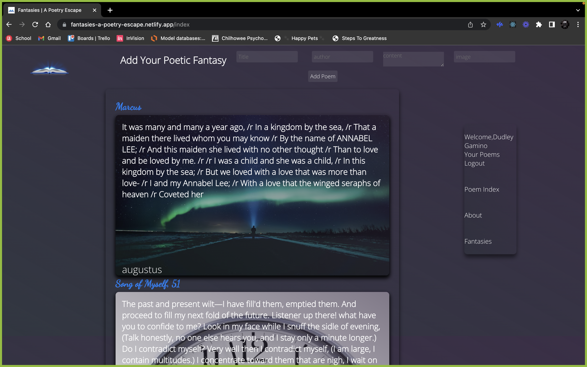
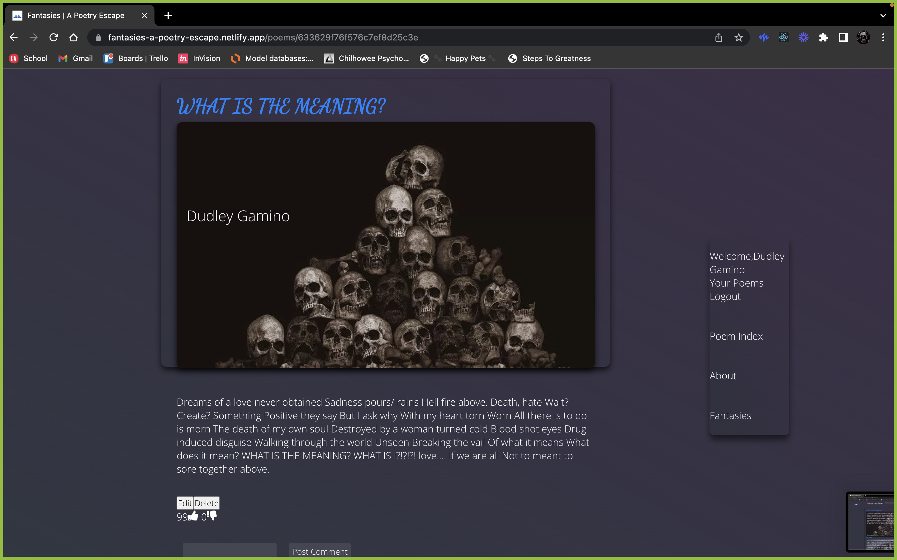

# Fantasies: A Poetry Escape

### A Public Poetry Blog, where users can create an account and contribute by adding or commenting on existing poetry.
    Fantasies: A Poetry Escape is the brain child of 4 GA Programming Students who, after much thought realized their shared love of poetry. So, they descided that they would make a place where Poets can share their work with the world. as well as a place where they can easily peruse the classics and take inspiration from the poets of the past.

## Technologies Used
    - Node.js
    - MongoDB
    - React
    - Heroku
    - Netlify
    - stands4 API

## Screenshot

## Getting Started

[Fantasies-App](https://fantasies-a-poetry-escape.netlify.app/)
[Fantasies-Server](https://fantasies-a-poetry-escape.herokuapp.com/api/poems/)

    

## Future Enhancements
    -Users are able to leave a review/rating for the App
    -Users are able to search for poems by Author/Tag/User
    -Users are able to block other users
    -User be able to message other users
    -Poets get-together